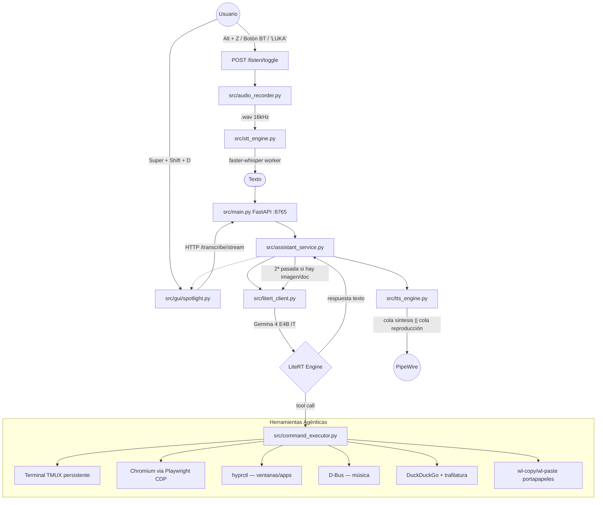

# AsistenteIA — Luka

Asistente de voz agéntico para **Linux (CachyOS/Hyprland)** diseñado para funcionar **100% en local y offline**. Una extensión del sistema operativo que permite interactuar por voz o texto en español natural para controlar aplicaciones, ejecutar comandos, automatizar la navegación web, sintetizar documentos y analizar la pantalla.

<p align="center">
  
  
  
  
  
</p>

---

## Flujo de Funcionamiento



---

## Arquitectura

### Motor único: LiteRT (Gemma 4 E4B IT)

Todo (inferencia de texto, tool calling, visión multimodal, audio nativo) corre en un único motor LiteRT instanciado una sola vez durante el `lifespan` de FastAPI. No hay modelos separados.

**Backends configurables:**
- `auto` (recomendado) — LiteRT decide internamente
- `gpu` — fuerza LLM en GPU, visión/audio en CPU (evita colisiones de VRAM)
- `cpu` — máxima compatibilidad

**Truncamiento inteligente** (nunca supera la ventana de 4096 tokens):
- System prompt: 2400 chars
- Contexto hardware: 3000 chars
- Historial antiguo: 600 chars
- Últimos turnos: 6000 chars
- Prompt nuevo: 2000 chars

**Retry automático:** si LiteRT falla al parsear tool calls, reintenta sin herramientas.

### STT: faster-whisper en worker dedicado

`src/stt_engine.py` delega en `src/stt_worker.py`, un **proceso Python separado** que mantiene el modelo `large-v3-turbo` residente en memoria. Comunica por JSON sobre `stdin/stdout` para aislar CTranslate2 de LiteRT y evitar contención de hilos.

Alternativa: `STT_USE_GEMMA_AUDIO=True` usa el audio nativo de Gemma directamente.

Pre-procesamiento: FFmpeg `loudnorm` + resampleo a 16 kHz mono antes de enviar al modelo.

### TTS: Kokoro en CPU + pipeline doble cola

`src/tts_engine.py` ejecuta Kokoro-82M forzado en CPU para liberar GPU a LiteRT. Implementa un pipeline de **doble cola asíncrona** donde síntesis y reproducción corren en paralelo:

```
frases → [cola síntesis] → _synth_worker → [cola audio] → _play_worker → OutputStream persistente
```

El `OutputStream` de sounddevice permanece abierto entre frases (sin latencia open/close). Fallback a gTTS si Kokoro falla.

### Visión y documentos: flujo de 2 pasadas

Cuando el LLM invoca `analyze_screen` o `create_document`, la primera pasada solo registra la petición (`stage_vision_capture` / `stage_document`). `AssistantService` detecta el flag y lanza una **segunda llamada a LiteRT** con la imagen adjunta o con instrucciones para redactar el documento. Esto evita que el parser de argumentos del SDK malformé contenido complejo.

### Wake word y botones Bluetooth

- **Wake word:** `src/wake_word_listener.py` ejecuta Sherpa-ONNX en hilo daemon, detecta la palabra "LUKA" con un threshold configurable y llama a `toggle_listen`.
- **Botones Bluetooth:** `src/bt_button_listener.py` lee eventos `evdev` del speaker (HOME SPA / AVRCP). PLAY arranca grabación, PAUSE cancela. Un proceso `mpris-proxy` traduce AVRCP a D-Bus MPRIS.

---

## Capacidades

### Terminal persistente (TMUX)

Todos los comandos se ejecutan en una sesión `tmux` llamada `asistenteia` abierta en una terminal gráfica visible (Alacritty / Kitty / Foot). El usuario ve en tiempo real qué ejecuta el asistente, puede escribir contraseñas `sudo` o interactuar directamente.

- `read_terminal_screen` captura las últimas líneas para que el modelo inspeccione resultados.
- `send_input_to_terminal` envía respuestas a prompts interactivos ([Y/n], contraseñas, etc.).
- `interrupt_terminal_command` envía Ctrl+C.
- Detección automática: si sudo pide contraseña, el asistente se detiene y avisa al usuario.

### Automatización de navegador (Playwright + CDP)

`control_local_browser` controla un Chromium visible usando el Chrome DevTools Protocol:

| Action | Descripción |
|--------|-------------|
| `launch` | Abre Chromium con depuración en puerto 9222 |
| `navigate` | Navega a URL |
| `click` | Click en selector CSS |
| `type` | Escribe texto en selector |
| `read` | Extrae texto limpio de la página |
| `look` | Captura visual de la web (no del escritorio) |
| `scroll` | Desplaza la página |
| `research` | Navega por hasta 30 páginas para investigación profunda |
| `clip` | Guarda resumen en Obsidian Vault/Clippings |
| `translate` | Inyecta interfaz de traducción flotante |

### Visión multimodal

`analyze_screen` captura pantalla completa, ventana activa, ventana por nombre o región interactiva (`slurp`). La imagen se redimensiona a máx. 800px y se envía a Gemma en la segunda pasada.

`analyze_clipboard_image` analiza cualquier imagen copiada en el portapapeles (detecta MIME `image/*` con `wl-paste`).

### Generación de documentos ODT

`create_document` genera archivos `.odt` desde Markdown en `~/Documentos`. Soporta: encabezados (H1–H3), párrafos, viñetas, listas numeradas, negrita, cursiva, bloques de código. Abre el documento en LibreOffice al finalizar.

### Música con Spotify (D-Bus)

`play_specific_music` busca artista/canción con DuckDuckGo, extrae el URI de Spotify (`spotify:artist:ID`), abre Spotify si no está corriendo y usa D-Bus `OpenUri` para reproducción inmediata.

### Audio Bluetooth inteligente

Antes de grabar, pausa los reproductores activos (`playerctl pause`). Al terminar los reanuda. El sink Bluetooth se auto-configura al arrancar el servicio.

---

## Herramientas Registradas (18 tools)

| Herramienta | Entradas | Descripción |
|---|---|---|
| `execute_system_command` | `command` | Ejecuta comando en tmux visible |
| `open_terminal_and_run_command` | `command` | Abre terminal/pestaña tmux y ejecuta |
| `read_terminal_screen` | — | Lee últimas ~60 líneas de tmux |
| `send_input_to_terminal` | `input_text` | Envía entrada a stdin (responde prompts) |
| `interrupt_terminal_command` | — | Ctrl+C al proceso en primer plano |
| `clipboard_manager` | `action`, `content` | Lee/escribe portapapeles Wayland |
| `analyze_clipboard_image` | — | Analiza imagen en portapapeles |
| `analyze_screen` | `source`, `target` | Captura + análisis visual (2ª pasada) |
| `take_screenshot` | — | Captura → portapapeles → satty |
| `web_search` | `query` | Búsqueda DuckDuckGo (máx. 3500 chars) |
| `read_web_page` | `url` | Extrae texto limpio (trafilatura) |
| `control_local_browser` | `action`, `target`, `value` | Chromium CDP (launch/navigate/click/…) |
| `play_specific_music` | `query` | Busca y reproduce en Spotify |
| `launch_application` | `app_name` | Lanza app por nombre (.desktop files) |
| `close_application` | `app_name` | Cierra ventana + fallback por PID |
| `system_diagnostics` | `component` | Extrae logs de journalctl |
| `read_log_file` | `service` | Lee logs de systemd |
| `create_document` | `title` | Genera documento ODT (2ª pasada) |

---

## API REST (FastAPI :8765)

Autenticación opcional vía `X-API-Token` header o `?token=` query param. Rate limiting por IP.

| Método | Endpoint | Descripción |
|--------|----------|-------------|
| POST | `/transcribe/stream` | Streaming SSE de inferencia (principal) |
| POST | `/transcribe` | Inferencia no-streaming |
| POST | `/listen/toggle` | Alterna grabación de micrófono |
| POST | `/cancel` | Cancela procesamiento/TTS en curso |
| POST | `/reset` | Reinicia historial de conversación |
| POST | `/audio/configure` | Reconfigura sink Bluetooth |
| GET | `/status` | Estado actual (JSON) |
| GET | `/status/events` | Eventos SSE en tiempo real (polling 300ms) |
| GET | `/chat` | Interfaz web HTML |
| GET | `/health` | Healthcheck (litert, whisper, kokoro, tmux, cdp) |
| GET | `/history` | Historial de conversación |

---

## Estructura del Proyecto

```
src/
  main.py               — FastAPI: endpoints, lifespan, rate limiting, listeners
  assistant_service.py  — Orquestador: STT → LiteRT → Tools → TTS, 2ª pasada visión/doc
  litert_client.py      — Cliente LiteRT: streaming, truncamiento, retry, visión
  command_executor.py   — Implementación de las 18 herramientas del sistema
  vision_tool.py        — Capturas de pantalla (grim/slurp) y portapapeles imagen
  document_tool.py      — Generación ODT desde Markdown (XML + ZIP)
  context_injector.py   — Contexto hardware (CPU, GPU, RAM, red, ventanas) para el prompt
  stt_engine.py         — Fachada STT: normaliza audio, delega en worker
  stt_worker.py         — Proceso dedicado faster-whisper (modelo residente)
  tts_engine.py         — Kokoro TTS: pipeline doble cola síntesis + reproducción
  wake_word_listener.py — Sherpa-ONNX: detecta "LUKA" en background
  bt_button_listener.py — evdev: captura botones AVRCP del speaker Bluetooth
  mpris_dummy_player.py — Dummy MPRIS MediaPlayer2 para interceptar AVRCP → D-Bus
  audio_manager.py      — Configuración dinámica de sinks/sources PipeWire
  audio_recorder.py     — Grabación de micrófono con detección de silencio
  config.py             — Settings con Pydantic (env vars)
  schema.py             — ChatMessage (role, content, images)
  gui/spotlight.py      — Interfaz Qt/PySide6: animaciones listening/thinking/speaking

config/
  system_prompt.txt     — Personalidad, árbol de decisión de tools, reglas críticas
  omarchy_commands.md   — Referencia de comandos omarchy para el sistema

scripts/
  handy-toggle.sh       — Lanzador inteligente: levanta servicio + GUI + toggle_listen
  start-assistant.sh    — Arranca uvicorn con configuración del entorno
  start-gui.sh          — Lanza únicamente la GUI Spotlight

services/
  asistenteia.service   — Unit systemd (Type=simple, Restart=on-failure)
```

---

## Instalación y Uso

### Requisitos

- CachyOS / Arch Linux con Hyprland y PipeWire
- Python 3.11 + `venv`
- `tmux`, `grim`, `slurp`, `wl-clipboard`
- `whisper.cpp` no requerido — STT usa `faster-whisper` (Python, se instala con pip)
- Modelo LiteRT en `models/gemma-4-E4B-it.litertlm`
- Modelos Sherpa-ONNX para wake word en el directorio configurado en `WAKE_WORD_MODEL_DIR`

### Instalación

```bash
git clone <repo>
cd asistenteia
./install.sh          # crea venv, instala dependencias
./installservice.sh   # instala el unit systemd de usuario
./startservice.sh     # arranca el servicio
```

### Comandos de utilidad

```bash
./startservice.sh     # arranca el servicio systemd
./stopservice.sh      # detiene el servicio
./logs.sh             # journalctl -f en tiempo real
./scripts/start-gui.sh  # lanza solo la GUI Spotlight
```

### Atajos de teclado (Hyprland)

Añade en `hyprland.conf`:

```
bind = Alt, Z, exec, ~/develop/asistenteia/scripts/handy-toggle.sh
bind = SUPER SHIFT, D, exec, ~/develop/asistenteia/scripts/start-gui.sh
```

- `Alt + Z` — Alterna grabación (habla → envía automáticamente)
- `Super + Shift + D` — Muestra / oculta la interfaz Spotlight
- Di **"LUKA"** — Wake word que activa grabación sin tocar teclado
- **PLAY** en el speaker Bluetooth — Activa grabación
- **PAUSE** en el speaker Bluetooth — Cancela procesamiento

### Variables de entorno relevantes

```bash
LITERT_MODEL_PATH=models/gemma-4-E4B-it.litertlm
LITERT_BACKEND=auto           # auto | gpu | cpu
STT_MODEL=large-v3-turbo
STT_DEVICE=cpu
STT_COMPUTE_TYPE=int8
STT_USE_GEMMA_AUDIO=False     # True para usar audio nativo de Gemma
KOKORO_VOICE=em_alex
KOKORO_LANG=e
WAKE_WORD_ENABLED=True
API_TOKEN=                    # vacío = sin autenticación
```

---

<p align="center">Hecho para Linux. Funciona offline.</p>
