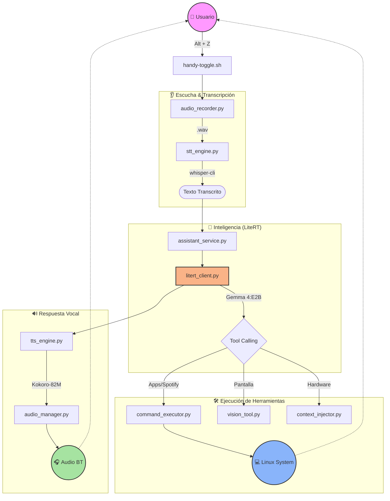

# 🎙️ AsistenteIA

Asistente de voz inteligente para **Linux (CachyOS/Hyprland)** diseñado para funcionar **100% en local**. Una extensión agentic del sistema operativo que permite interactuar mediante lenguaje natural para gestionar ventanas, aplicaciones, música y diagnosticar el sistema.

<p align="center">
  
  
  
  
</p>

---

## 🚀 Flujo de Funcionamiento

El asistente utiliza un ciclo de vida reactivo y asíncrono para procesar peticiones de voz en tiempo real:



---

## 🛠️ Capacidades Destacadas

| Herramienta | Descripción |
| :--- | :--- |
| **Tool Calling Nativo** | Integración directa con Python docs para llamar funciones sin parseo JSON. |
| **Spotify Automático** | Al decir "Música", el asistente abre Spotify y lanza el play automáticamente. |
| **Visión de Pantalla** | `analyze_screen` captura tu monitor y permite al modelo "ver" errores o contenido. |
| **Gestión de Ventanas** | Control total de Hyprland: mover, cerrar, enfocar o cambiar workspaces. |
| **Diagnóstico** | Lectura de logs de `systemd` para autodiagnóstico de audio o bluetooth. |
| **Portapapeles** | Capacidad de leer (`paste`) y escribir (`copy`) en el clipboard de Wayland. |

---

## 🏗️ Arquitectura Técnica (LiteRT)

AsistenteIA ha migrado de Ollama a **LiteRT (Google AI Edge)** para maximizar la eficiencia y latencia:

- **Orquestador FastAPI**: Servidor asíncrono en el puerto `8765`.
- **Motor Gemma 4:E2B**: Optimizado para ejecución en dispositivos locales con soporte multimodal.
- **Kokoro-82M TTS**: Generación de voz natural de alta calidad (100% offline).
- **Whisper-cpp STT**: Transcripción rápida usando `ggml-small.bin`.
- **PipeWire Integration**: Conexión automática a dispositivos Bluetooth (micrófonos y altavoces).

---

## 🛠️ Instalación y Uso

### Instalación Rápida
```bash
git clone https://github.com/tu-usuario/asistenteia.git
cd asistenteia
./install.sh
```

### Comandos de Servicio
```bash
./startservice.sh    # Inicia el asistente como servicio de usuario
./stopservice.sh     # Detiene el servicio
./logs.sh            # Ver logs en tiempo real
```

### Keybindings (Hyprland)
- `Alt + Z`: **Toggle Escucha**. Presiona una vez para empezar a hablar, otra para procesar.
- `Super + Spotlight`: Interfaz visual tipo Spotlight para consultas escritas.

---

## 📁 Estructura del Proyecto

- `src/litert_client.py`: Corazón de la inferencia LiteRT con soporte nativo de herramientas.
- `src/command_executor.py`: Ejecución segura de comandos con lista blanca y lógica especial.
- `src/gui/spotlight.py`: Interfaz visual minimalista en PySide6.
- `config/system_prompt.txt`: La "personalidad" y reglas críticas del asistente.
- `scripts/`: Lanzadores y utilidades de audio.

---
<p align="center">
  Hecho con ❤️ para la comunidad de Linux y Hyprland.
</p>
