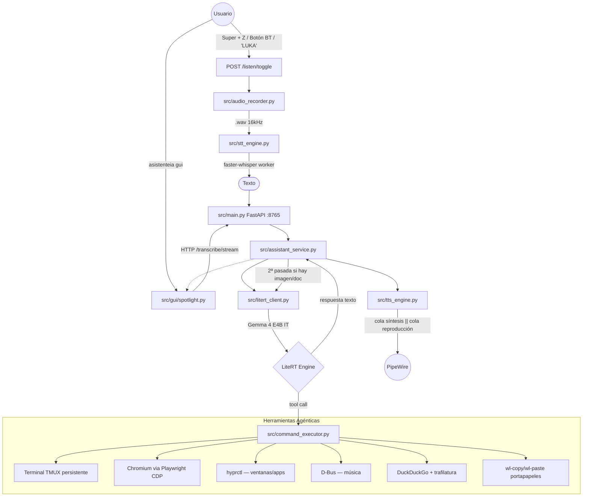

# AsistenteIA — Luka

<p align="center"><b>⚡ Instálalo en un solo comando</b> en CachyOS — Omarchy o Hyprland:</p>

```bash
curl -fsSL https://raw.githubusercontent.com/vicherarr/asistenteIaOmarchy/master/install.sh | bash
```

Asistente de voz agéntico para **Linux (CachyOS/Hyprland)** diseñado para funcionar **100% en local y offline**. Una extensión del sistema operativo que permite interactuar por voz o texto en español natural para controlar aplicaciones, ejecutar comandos, automatizar la navegación web, sintetizar documentos y analizar la pantalla.

<p align="center">
  
  
  
  
  
</p>

---

## Flujo de Funcionamiento



---

## Arquitectura

### Motor único: LiteRT (Gemma 4 E4B IT)

Todo (inferencia de texto, tool calling, visión multimodal, audio nativo) corre en un único motor LiteRT instanciado una sola vez durante el `lifespan` de FastAPI. No hay modelos separados.

**Backends configurables:**
- `auto` (recomendado) — LiteRT decide internamente
- `gpu` — fuerza LLM en GPU, visión/audio en CPU (evita colisiones de VRAM)
- `cpu` — máxima compatibilidad

**Truncamiento inteligente** (nunca supera la ventana de 4096 tokens):
- System prompt: 2400 chars
- Contexto hardware: 3000 chars
- Historial antiguo: 600 chars
- Últimos turnos: 6000 chars
- Prompt nuevo: 2000 chars

**Retry automático:** si LiteRT falla al parsear tool calls, reintenta sin herramientas.

### Motor intercambiable: LiteRT ⇄ ExLlamaV3 ⇄ OpenRouter (opcional)

El motor de inferencia es **conmutable** y 100% retrocompatible: LiteRT es el de por defecto y nada cambia si no tocas nada. La factoría `src/engines/factory.py` construye el motor según `AI_ENGINE` y todo el sistema lo consume por un contrato común (`src/engines/base.py`: `InferenceEngine` + `EngineCapabilities`), de modo que el resto actúa **por capacidades**, no por nombre de motor.

- **`litert` (defecto):** Gemma 4 en proceso; texto, tools, visión y audio nativos.
- **`exllama`:** Qwen3 cuantizado EXL3 sobre un **sidecar [TabbyAPI](https://github.com/theroyallab/tabbyAPI)** (servidor OpenAI-compatible en GPU). El bucle agéntico de tool-calling es propio (`src/engines/exllama_engine.py`); no hace audio (el STT cae a Whisper por capacidades). Aislado en su propio venv para no mezclar las dependencias de torch/CUDA con las del asistente.

- **`openrouter`:** un LLM **en la nube** por HTTP ([OpenRouter](https://openrouter.ai)), sin VRAM ni descargas. Solo se ofrecen modelos **gratis y con tool calling**; por defecto `google/gemma-4-31b-it:free` (30,7B, 256k de contexto y **acepta imágenes**, así que la cámara del satélite y el análisis de pantalla los describe él). Reutiliza el cliente OpenAI-compatible de `exllama` (`src/engines/openrouter_engine.py` hereda de él). Ver [docs/motor-openrouter.md](docs/motor-openrouter.md).

**Solo un motor activo a la vez** (en una GPU de 8 GiB no coexisten): al usar LiteRT no corre TabbyAPI y viceversa. El sidecar se instala, arranca/para y se conmuta con `asistenteia engine` (ver abajo); con `AI_ENGINE=exllama` el asistente levanta TabbyAPI al arrancar (como LiteRT se carga solo) y lo para al detenerse.

### STT: configurable (faster-whisper o Gemma audio nativo)

`src/stt_engine.py` soporta dos backends seleccionables con `STT_USE_GEMMA_AUDIO`:

- **`False` (defecto) — faster-whisper:** delega en `src/stt_worker.py`, un proceso Python separado que mantiene el modelo `large-v3-turbo` residente en memoria. Comunica por JSON sobre `stdin/stdout` para aislar CTranslate2 de LiteRT y evitar contención de hilos.
- **`True` — Gemma audio nativo:** usa el soporte de audio del propio motor LiteRT, sin proceso externo. Si el motor activo no soporta audio (p.ej. ExLlama), el STT **cae automáticamente a Whisper** (decisión por `capabilities.audio`, no por configuración manual).

En ambos casos el audio se pre-procesa primero con FFmpeg (`loudnorm` + resampleo a 16 kHz mono).

### TTS: Kokoro en CPU + pipeline doble cola

`src/tts_engine.py` ejecuta Kokoro-82M forzado en CPU para liberar GPU a LiteRT. Implementa un pipeline de **doble cola asíncrona** donde síntesis y reproducción corren en paralelo:

```
frases → [cola síntesis] → _synth_worker → [cola audio] → _play_worker → OutputStream persistente
```

El `OutputStream` de sounddevice permanece abierto entre frases (sin latencia open/close). Fallback a gTTS si Kokoro falla.

### Visión y documentos: flujo de 2 pasadas

Cuando el LLM invoca `analyze_screen` o `create_document`, la primera pasada solo registra la petición (`stage_vision_capture` / `stage_document`). `AssistantService` detecta el flag y lanza una **segunda llamada a LiteRT** con la imagen adjunta o con instrucciones para redactar el documento. Esto evita que el parser de argumentos del SDK malformé contenido complejo.

### Wake word y botones Bluetooth

- **Wake word:** `src/wake_word_listener.py` ejecuta Sherpa-ONNX en hilo daemon, detecta la palabra "LUKA" con un threshold configurable y llama a `toggle_listen`.
- **Botones Bluetooth:** `src/bt_button_listener.py` lee eventos `evdev` del speaker (HOME SPA / AVRCP). PLAY arranca grabación, PAUSE cancela. Un proceso `mpris-proxy` traduce AVRCP a D-Bus MPRIS.

---

## Capacidades

### Terminal persistente (TMUX)

Todos los comandos se ejecutan en una sesión `tmux` llamada `asistenteia` abierta en una terminal gráfica visible (Alacritty / Kitty / Foot). El usuario ve en tiempo real qué ejecuta el asistente, puede escribir contraseñas `sudo` o interactuar directamente.

- `read_terminal_screen` captura las últimas líneas para que el modelo inspeccione resultados.
- `send_input_to_terminal` envía respuestas a prompts interactivos ([Y/n], contraseñas, etc.).
- `interrupt_terminal_command` envía Ctrl+C.
- Detección automática: si sudo pide contraseña, el asistente se detiene y avisa al usuario.

### Automatización de navegador (Playwright + CDP)

`control_local_browser` controla un Chromium visible usando el Chrome DevTools Protocol:

| Action | Descripción |
|--------|-------------|
| `launch` | Abre Chromium con depuración en puerto 9222 |
| `navigate` | Navega a URL |
| `click` | Click en selector CSS |
| `type` | Escribe texto en selector |
| `read` | Extrae texto limpio de la página |
| `look` | Captura visual de la web (no del escritorio) |
| `scroll` | Desplaza la página |
| `research` | Navega por hasta 30 páginas para investigación profunda |
| `clip` | Guarda resumen en Obsidian Vault/Clippings |
| `translate` | Inyecta interfaz de traducción flotante |

### Visión multimodal

`analyze_screen` captura pantalla completa, ventana activa, ventana por nombre o región interactiva (`slurp`). La imagen se redimensiona a máx. 800px y se envía a Gemma en la segunda pasada.

`analyze_clipboard_image` analiza cualquier imagen copiada en el portapapeles (detecta MIME `image/*` con `wl-paste`).

### Generación de documentos ODT

`create_document` genera archivos `.odt` desde Markdown en `~/Documentos`. Soporta: encabezados (H1–H3), párrafos, viñetas, listas numeradas, negrita, cursiva, bloques de código. Abre el documento en LibreOffice al finalizar.

### Música con Spotify (D-Bus)

`play_specific_music` busca artista/canción con DuckDuckGo, extrae el URI de Spotify (`spotify:artist:ID`), abre Spotify si no está corriendo y usa D-Bus `OpenUri` para reproducción inmediata.

### Audio Bluetooth inteligente

Antes de grabar, pausa los reproductores activos (`playerctl pause`). Al terminar los reanuda. El sink Bluetooth se auto-configura al arrancar el servicio.

---

## Herramientas Registradas (18 tools)

| Herramienta | Entradas | Descripción |
|---|---|---|
| `execute_system_command` | `command` | Ejecuta comando en tmux visible |
| `open_terminal_and_run_command` | `command` | Abre terminal/pestaña tmux y ejecuta |
| `read_terminal_screen` | — | Lee últimas ~60 líneas de tmux |
| `send_input_to_terminal` | `input_text` | Envía entrada a stdin (responde prompts) |
| `interrupt_terminal_command` | — | Ctrl+C al proceso en primer plano |
| `clipboard_manager` | `action`, `content` | Lee/escribe portapapeles Wayland |
| `analyze_clipboard_image` | — | Analiza imagen en portapapeles |
| `analyze_screen` | `source`, `target` | Captura + análisis visual (2ª pasada) |
| `take_screenshot` | — | Captura → portapapeles → satty |
| `web_search` | `query` | Búsqueda DuckDuckGo (máx. 3500 chars) |
| `read_web_page` | `url` | Extrae texto limpio (trafilatura) |
| `control_local_browser` | `action`, `target`, `value` | Chromium CDP (launch/navigate/click/…) |
| `play_specific_music` | `query` | Busca y reproduce en Spotify |
| `launch_application` | `app_name` | Lanza app por nombre (.desktop files) |
| `close_application` | `app_name` | Cierra ventana + fallback por PID |
| `system_diagnostics` | `component` | Extrae logs de journalctl |
| `read_log_file` | `service` | Lee logs de systemd |
| `create_document` | `title` | Genera documento ODT (2ª pasada) |

---

## API REST (FastAPI :8765)

Autenticación opcional vía `X-API-Token` header o `?token=` query param. Rate limiting por IP.

| Método | Endpoint | Descripción |
|--------|----------|-------------|
| POST | `/transcribe/stream` | Streaming SSE de inferencia (principal) |
| POST | `/transcribe` | Inferencia no-streaming |
| POST | `/listen/toggle` | Alterna grabación de micrófono |
| POST | `/cancel` | Cancela procesamiento/TTS en curso |
| POST | `/reset` | Reinicia historial de conversación |
| POST | `/audio/configure` | Reconfigura sink Bluetooth |
| GET | `/status` | Estado actual (JSON) |
| GET | `/status/events` | Eventos SSE en tiempo real (polling 300ms) |
| GET | `/chat` | Interfaz web HTML |
| GET | `/health` | Healthcheck (litert, whisper, kokoro, tmux, cdp) |
| GET | `/history` | Historial de conversación |

---

## Estructura del Proyecto

```
src/
  main.py               — FastAPI: endpoints, lifespan, rate limiting, listeners
  assistant_service.py  — Orquestador: STT → LiteRT → Tools → TTS, 2ª pasada visión/doc
  litert_client.py      — Cliente LiteRT: streaming, truncamiento, retry, visión
  command_executor.py   — Implementación de las 18 herramientas del sistema
  vision_tool.py        — Capturas de pantalla (grim/slurp) y portapapeles imagen
  document_tool.py      — Generación ODT desde Markdown (XML + ZIP)
  context_injector.py   — Contexto hardware (CPU, GPU, RAM, red, ventanas) para el prompt
  stt_engine.py         — Fachada STT: normaliza audio, delega en worker
  stt_worker.py         — Proceso dedicado faster-whisper (modelo residente)
  tts_engine.py         — Kokoro TTS: pipeline doble cola síntesis + reproducción
  wake_word_listener.py — Sherpa-ONNX: detecta "LUKA" en background
  bt_button_listener.py — evdev: captura botones AVRCP del speaker Bluetooth
  mpris_dummy_player.py — Dummy MPRIS MediaPlayer2 para interceptar AVRCP → D-Bus
  audio_manager.py      — Configuración dinámica de sinks/sources PipeWire
  audio_recorder.py     — Grabación de micrófono con detección de silencio
  config.py             — Settings con Pydantic (env vars)
  schema.py             — ChatMessage (role, content, images)
  gui/spotlight.py      — Interfaz Qt/PySide6: animaciones listening/thinking/speaking

config/
  system_prompt.txt     — Personalidad, árbol de decisión de tools, reglas críticas
  omarchy_commands.md   — Referencia de comandos omarchy para el sistema

scripts/
  asistenteia           — CLI: start/stop/toggle/status/logs/gui/service/update/uninstall
  _common.sh            — Helpers compartidos (servicio systemd o proceso directo)
  handy-toggle.sh       — Lanzador inteligente: levanta el motor + GUI + toggle_listen
  stop-assistant.sh     — Detenedor (Super + X), funciona con o sin servicio
  start-gui.sh          — Lanza únicamente la GUI Spotlight
  setup-keybindings.sh  — Configura Super+Z/X (Omarchy-Lua, Omarchy nativo o Hyprland)
  generate-certs.sh     — Genera certificados SSL autofirmados

install.sh              — Instalador de un comando (bootstrap curl | bash o clon local)
installservice.sh       — Crea el unit systemd de usuario (rutas dinámicas)
uninstall.sh            — Desinstalador completo
```

---

<h2 align="center">🚀 Instalación</h2>

<p align="center"><b>Un solo comando.</b> Sin clonar nada, sin configurar nada.<br>Pégalo en tu terminal, contesta dos preguntas y listo.</p>

```bash
curl -fsSL https://raw.githubusercontent.com/vicherarr/asistenteIaOmarchy/master/install.sh | bash
```

<p align="center">
  
  
  
</p>

Durante la instalación solo se te pide **dos cosas**:

> 🔑 **1. Tu contraseña de `sudo`** — para instalar las dependencias del sistema.
>
> 🛠️ **2. ¿Servicio o bajo demanda?** — si quieres dejarlo preparado para siempre o arrancarlo tú.

Lo demás es automático: clona el proyecto, prepara el entorno Python, descarga el modelo **Gemma (~3.6 GB)**, genera la configuración (token + certificados SSL), instala el comando `asistenteia` y configura los atajos de teclado. ☕ *Tarda un rato — el modelo pesa.*

### 🎛️ Modos de funcionamiento

| Modo | Cuándo elegirlo | Cómo |
|------|-----------------|------|
| **Bajo demanda** | Uso ocasional. Arranca al pulsar `Super + Z`. | responde `n` (o `--no-service`) |
| **Servicio** | Uso habitual. Lo gestiona systemd y se reinicia solo si falla. | responde `s` (o `--service`) |
| **Arranque en sesión** | *«Dejarlo para siempre».* Listo nada más iniciar sesión. | `s` + `s` (o `--enable-boot`) |

### 🎹 Atajos de teclado

El instalador los configura solo (detecta **Omarchy-Lua**, **Omarchy nativo** o **Hyprland puro**):

| Atajo | Acción |
|-------|--------|
| **`Super + Z`** | 🎙️ Arranca / habla con el asistente — *habla y se envía solo* |
| **`Super + X`** | ⏹️ Detiene el asistente |
| Di **«LUKA»** | 🗣️ Wake word: activa la grabación sin tocar el teclado |
| **▶ PLAY** *(speaker BT)* | Activa grabación |
| **⏸ PAUSE** *(speaker BT)* | Cancela el procesamiento |

> 💡 ¿Los atajos no responden tras instalar? Ejecuta `hyprctl reload`.

### 🧰 El comando `asistenteia`

Disponible en tu terminal desde cualquier sitio (vive en `~/.local/bin`):

```bash
asistenteia start      # arranca            asistenteia status     # estado actual
asistenteia stop       # detiene            asistenteia logs       # logs en vivo
asistenteia toggle     # = Super + Z        asistenteia gui        # solo la GUI
asistenteia restart    # reinicia           asistenteia update     # actualiza
asistenteia model …    # cambia el modelo   asistenteia engine …   # cambia el motor
asistenteia uninstall  # desinstala         asistenteia service …  # gestiona el servicio
```

**Cambiar de motor de inferencia** (LiteRT ⇄ ExLlamaV3):

```bash
asistenteia engine              # motor actual + disponibles (estado del sidecar)
asistenteia engine install      # instala el backend exllama (TabbyAPI + modelo EXL3, ~15 GB)
asistenteia engine exllama      # conmuta a ExLlamaV3 y reinicia
asistenteia engine litert       # vuelve a LiteRT (para el sidecar, libera VRAM)
asistenteia engine model        # modelo exllama: qwen3-8b (texto) / qwen3-vl (visión)
asistenteia engine model qwen3-vl   # descarga/activa Qwen3-VL (multimodal) y reinicia
asistenteia engine start|stop   # control manual del sidecar TabbyAPI
```

**Modelos exllama** (catálogo): `qwen3-8b` (texto + tools, rápido) y `qwen3-vl`
(Qwen3-VL-8B multimodal: texto + tools + **visión**, para `analyze_screen`). El
comando descarga el modelo si falta, ajusta `EXLLAMA_VISION` automáticamente y la
config de TabbyAPI, y reinicia. En 8 GiB el VL cabe a 3.5bpw con contexto 6144
(~2.7 GB libres tras cargar); si en tu GPU no entra, baja a un bpw menor.

<details>
<summary><b>⚙️ Opciones avanzadas, instalación manual y desinstalación</b></summary>

#### Requisitos

- CachyOS / Arch Linux con Hyprland (u Omarchy) y PipeWire
- Python 3.11 o 3.12 (el `python` 3.13+ del sistema no sirve para Kokoro — el instalador lo gestiona)

#### Instalación desde un clon local

```bash
git clone https://github.com/vicherarr/asistenteIaOmarchy.git
cd asistenteIaOmarchy
./install.sh
```

#### Flags no interactivos

```bash
./install.sh --service          # instala el servicio (arranque bajo demanda)
./install.sh --enable-boot      # servicio + arranque automático al iniciar sesión
./install.sh --no-service       # solo modo bajo demanda (Super + Z)
./install.sh --dir ~/apps/luka  # instalar en otra carpeta
./install.sh --no-keybind       # no tocar los atajos de Hyprland
```

#### Desinstalación

```bash
asistenteia uninstall     # o bien:  ~/.asistenteia/uninstall.sh
~/.asistenteia/uninstall.sh --purge   # borra también carpeta + modelos
```

#### Variables de entorno (`~/.asistenteia/.env`)

```bash
LITERT_MODEL_PATH=models/gemma-4-E4B-it.litertlm
LITERT_BACKEND=gpu            # auto | gpu | cpu
STT_USE_GEMMA_AUDIO=False     # True = audio nativo de Gemma | False = faster-whisper
STT_MODEL=large-v3-turbo
STT_DEVICE=cpu
STT_COMPUTE_TYPE=int8
KOKORO_VOICE=em_alex          # em_alex | em_santa | ef_dora
KOKORO_LANG=e                 # e (español) | a (inglés US) | b (inglés UK)
WAKE_WORD_ENABLED=True
WAKE_WORD_THRESHOLD=0.10      # más bajo = más sensible
API_TOKEN=                    # el instalador genera uno seguro
GOOGLE_ENABLED=True          # tools de Gmail (requiere credenciales propias, ver abajo)
```

</details>

---

## 📧 Integración con Gmail y Google Calendar (opcional)

Luka puede leer, buscar y (con confirmación por voz) enviar correos de **tu propia
cuenta** de Gmail, y consultar/crear/mover/borrar eventos de tu **Google Calendar**.
Es **gratis**: ni la Gmail API ni la Calendar API facturan y no necesitas tarjeta.
Ambas funciones comparten un único alta de OAuth (un solo `token.json`).

> **Privacidad y secretos.** Cada usuario usa **sus propias** credenciales de Google
> (modelo *BYO – Bring Your Own*). El proyecto **NUNCA** incluye ni debes subir a git
> tu `credentials.json` (client secret) ni tu `token.json` (sesión). Ambos viven en
> `~/.config/asistenteia/google/`, fuera del repo, y están en `.gitignore`.

### 1. Crear las credenciales en Google Cloud (una vez)

1. Entra en [Google Cloud Console](https://console.cloud.google.com/) y crea un
   **proyecto** nuevo (gratis, sin tarjeta).
2. **APIs y servicios → Biblioteca →** busca **Gmail API** y pulsa **Habilitar**.
   Repite con **Google Calendar API** (búscala y **Habilítala** también).
3. **APIs y servicios → Pantalla de consentimiento de OAuth**:
   - Tipo de usuario: **External**.
   - Rellena nombre de la app y tu correo.
   - **Publicación:** pásala a **«In production»** (evita que el token caduque cada
     7 días). Como es para ti solo, **no necesitas verificación de Google**: al iniciar
     sesión saldrá un aviso de «app no verificada» → *Avanzado → Continuar*.
4. **APIs y servicios → Credenciales → Crear credenciales → ID de cliente de OAuth**:
   - Tipo de aplicación: **App de escritorio (Desktop app)**.
   - Descarga el JSON.
5. Guarda ese JSON como:
   ```
   ~/.config/asistenteia/google/credentials.json
   ```

### 2. Iniciar sesión (una vez)

```bash
asistenteia google-auth
```

Abre el navegador, das consentimiento, y se guarda `token.json` (permisos `0600`).
A partir de ahí el servicio refresca la sesión solo, sin volver a abrir el navegador.

> **¿Ya tenías Gmail configurado de antes?** El alta de Calendar añade un permiso
> nuevo (`calendar.events`), así que tu `token.json` anterior se queda corto. Vuelve a
> ejecutar `asistenteia google-auth` **una vez** para reconceder el consentimiento; si
> no, las llamadas al calendario darían un error 403 por scope insuficiente.

### 3. Verificar

```bash
cd ~/.asistenteia && venv/bin/python scripts/test-gmail-auth.py
```

Debe mostrar tu correo y el asunto del último mensaje (no envía ni modifica nada).

---

<p align="center">Hecho para Linux · Funciona <b>offline</b> · Habla con <b>«LUKA»</b> 🎙️</p>
