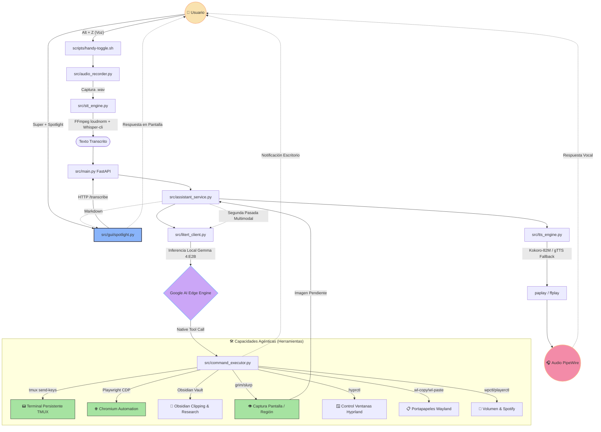

# 🎙️ AsistenteIA

Asistente de voz inteligente para **Linux (CachyOS/Hyprland)** diseñado para funcionar **100% en local y offline**. Una extensión agéntica del sistema operativo que permite interactuar mediante lenguaje natural para gestionar ventanas, automatizar tareas de navegación, controlar multimedia, interactuar con una terminal persistente y diagnosticar el sistema usando visión de pantalla.

<p align="center">
  
  
  
  
  
</p>

---

## 🚀 Flujo de Funcionamiento y Arquitectura

El asistente utiliza un ciclo de vida reactivo y asíncrono para procesar peticiones de voz o texto en tiempo real, coordinando el motor de inferencia local con herramientas del sistema:



---

## 🧠 Características Principales

### 1. Migración a LiteRT (Google AI Edge)
AsistenteIA ha migrado completamente su motor de inferencia local de Ollama a **LiteRT-LM (AI Edge SDK)**, utilizando el modelo **Gemma 4:E2B / 4:E4B**.
- **Tool Calling Nativo:** Eliminación absoluta de parseos JSON manuales o expresiones regulares. LiteRT invoca herramientas directamente analizando los docstrings y firmas de tipo de Python.
- **Optimización de Memoria:** El `Engine` de LiteRT se instancia una única vez durante el ciclo de vida `lifespan` de FastAPI, garantizando una latencia mínima.
- **Protección de Contexto:** Truncamiento automático e inteligente de prompts, historial de conversación y prompts de sistema para nunca saturar la ventana de 4096 tokens.

### 2. Terminal Persistente Inteligente (TMUX)
En lugar de lanzar comandos en procesos aislados invisibles, el asistente abre una terminal gráfica física (`Alacritty`/`Kitty`/`Foot`) ejecutando una sesión persistente de `tmux` llamada `asistenteia`.
- **Interacción en Vivo:** El usuario puede ver la terminal ejecutarse, escribir contraseñas de `sudo` o interactuar directamente.
- **Lectura Dinámica de Pantalla:** La herramienta `read_terminal_screen` captura el contenido visible de la consola tmux para que el modelo pueda inspeccionar salidas, detectar errores o saber si la consola espera una entrada del usuario.

### 3. Automatización de Navegación por CDP (Playwright)
A través de la herramienta `control_local_browser`, el asistente interactúa en tiempo real con un navegador Chromium visible utilizando el Protocolo de Depuración de Chrome (CDP).
- **Control Gráfico Completo:** Navega, hace clics en selectores CSS, escribe texto y hace scroll.
- **Investigación Profunda (Deep Research):** Navega y busca de forma autónoma por hasta 30 páginas web consecutivas, recopilando y consolidando información hasta estructurar un informe formal.
- **Clipping a Obsidian:** Guarda resúmenes formateados en Markdown directamente en la carpeta de Clippings del Obsidian Vault del usuario.
- **Traductor en Pantalla:** Traduce páginas completas inyectando una interfaz elegante flotante en el lateral del navegador.

### 4. Visión Multimodal Reactiva
Mediante `analyze_screen`, el asistente realiza capturas completas o de regiones específicas elegidas por el usuario (`grim` + `slurp`).
- Si se genera una imagen, el orquestador activa un flujo multimodal de segunda pasada, enviando la ruta de la captura a Gemma para que describa la interfaz o resuelva problemas visuales.

### 5. Audio de Alta Calidad y Cancelación Proactiva
- **STT (Speech-To-Text):** Transcripción local rápida mediante `whisper-cli` (`ggml-small.bin`). Pre-procesa y normaliza el audio usando filtros inteligentes de FFmpeg (`loudnorm`) y configurando un tamaño de haz (beam size) de 5.
- **TTS (Text-To-Speech):** Síntesis de voz ultra-natural en español usando **Kokoro-82M** de forma local. En caso de fallar, cambia automáticamente a `gTTS` con reproducción en segundo plano.
- **Cancelación Inmediata:** Si el usuario interrumpe con `Alt + Z` o mediante el botón de la UI, cualquier proceso de audio o generación del modelo en curso se detiene y descarta instantáneamente.

---

## 🛠️ Registro de Herramientas (Tool Registry)

El asistente dispone de las siguientes herramientas de Python puras registradas en LiteRT:

| Herramienta | Firma | Descripción |
| :--- | :--- | :--- |
| `execute_system_command` | `(command: str)` | Abre cualquier aplicación o ejecuta comandos permitidos de la lista blanca. |
| `open_terminal_and_run_command` | `(command: str)` | Abre/envía un comando a la terminal persistente TMUX en pantalla. |
| `read_terminal_screen` | `()` | Lee las últimas 40 líneas de la terminal persistente visible. |
| `control_local_browser` | `(action: str, target: str, value: str)` | Controla Chromium de forma visible (launch, navigate, click, type, research, clip, translate). |
| `analyze_screen` | `(region: str)` | Captura la pantalla completa (`full`) o región (`select`) y realiza un análisis visual. |
| `get_system_status` | `()` | Obtiene el estado actual del hardware (CPU, RAM, Audio BT). |
| `system_diagnostics` | `(component: str)` | Diagnostica servicios críticos del sistema como Bluetooth o PipeWire. |
| `read_log_file` | `(service: str)` | Lee los últimos logs de `systemd` para autodiagnósticos. |
| `clipboard_manager` | `(action: str, content: str)` | Copia texto o recupera contenido del portapapeles de Wayland. |
| `web_search` | `(query: str)` | Realiza búsquedas rápidas en la web. |
| `read_web_page` | `(url: str)` | Extrae y lee el texto principal de cualquier página web. |
| `interact_web` | `(action: str, target: str, value: str)` | Ejecuta acciones Playwright sin interfaz de usuario (headless) para extraer datos interactivos. |
| `play_specific_music` | `(query: str)` | Inicia Spotify y automatiza la búsqueda de una canción o artista específico. |
| `manage_windows` | `(action: str, target: str)` | Gestiona ventanas en Hyprland (enfocar, cerrar, mover escritorios, flotar). |

---

## 📂 Estructura del Proyecto

- `src/main.py`: Punto de entrada. Servidor FastAPI asíncrono con control de lifespan, estado y endpoints.
- `src/litert_client.py`: Inferencia de LiteRT-LM con truncamiento de contexto, soporte de imágenes y adaptación asíncrona de herramientas.
- `src/assistant_service.py`: Coordinador central de negocio (STT -> LiteRT -> Tools -> TTS).
- `src/command_executor.py`: Lógica detallada de herramientas del sistema, seguridad de comandos y automatización de navegador/terminal.
- `src/gui/spotlight.py`: Interfaz Spotlight en PySide6 con animaciones fluidas y colores del ecosistema Catppuccin.
- `src/stt_engine.py` & `src/tts_engine.py`: Motores locales de audio y síntesis.
- `src/audio_manager.py`: Configuración dinámica de sinks y sources PipeWire.
- `config/system_prompt.txt`: Personalidad, instrucciones agénticas y reglas de comportamiento del asistente.
- `scripts/`: Scripts lanzadores, grabadores de audio (`handy-toggle.sh`) y laboratorios de pruebas.

---

## 🚀 Instalación y Uso

### Requisitos Previos
El asistente está optimizado para CachyOS/Arch Linux con Hyprland, y requiere:
- `wireplumber` / `pipewire` (gestión de audio)
- `grim` y `slurp` (captura de pantalla)
- `tmux` (terminal persistente)
- `whisper-cli` (`whisper.cpp`) y modelo `ggml-small.bin` en `~/.cache/whisper/`
- Modelo LiteRT de Gemma en `models/gemma-4-E4B-it.litertlm`

### Instalación Rápida
1. Clonar el repositorio y ejecutar el instalador:
   ```bash
   git clone https://github.com/tu-usuario/asistenteia.git
   cd asistenteia
   ./install.sh
   ```
2. Iniciar el asistente como servicio de usuario `systemd`:
   ```bash
   ./installservice.sh
   ./startservice.sh
   ```

### Comandos de Utilidad
- `./stopservice.sh` - Detiene el servicio del asistente.
- `./logs.sh` - Muestra logs en tiempo real (`journalctl`).
- `./scripts/start-gui.sh` - Lanza la interfaz gráfica Spotlight manual.

### Atajos de Teclado (Hyprland)
Configura los siguientes keybindings en tu `hyprland.conf`:
- `Alt + Z`: Toggle de Escucha (presiona una vez para hablar, otra para enviar). Llama a `scripts/handy-toggle.sh`.
- `Super + Shift + D`: Lanza / Muestra la interfaz Spotlight PySide6.

---
<p align="center">
  Diseñado con una mentalidad agéntica avanzada y estética moderna. Hecho con ❤️ para Linux.
</p>
