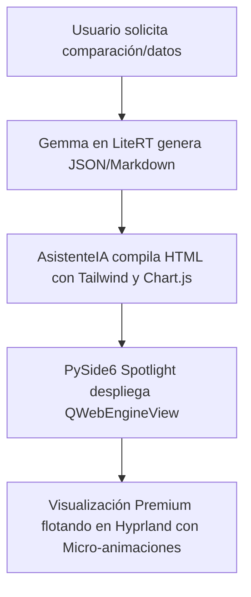

# 🚀 Plan de Futuras Mejoras y Herramientas Agénticas – AsistenteIA

Este documento recopila de manera detallada propuestas innovadoras para enriquecer y potenciar el atractivo, la productividad y el valor de **AsistenteIA** en su stack offline actual (**CachyOS/Linux, Hyprland, PySide6 Spotlight, LiteRT y Kokoro TTS**).

---

## 📋 Resumen de Herramientas Propuestas

| ID | Herramienta | Impacto Visual / Productividad | Complejidad Técnica | Dependencias Principales |
| :--- | :--- | :---: | :---: | :--- |
| **01** | `generate_visual_canvas` | 🔥 **Crítico (Espectacular)** | Media | PySide6 (QWebEngineView), Chart.js / TailwindCSS locales. |
| **02** | `active_window_ocr_and_action` | 👁️ **Muy Alto (Visión Contextual)** | Media | `grim`, `hyprctl`, Tesseract OCR / Gemma Vision. |
| **03** | `obsidian_neural_linker` | 🧠 **Alto (Productividad)** | Baja | Manipulación directa del Obsidian Vault (Python). |
| **04** | `system_performance_guardian` | ⚙️ **Alto (Diagnóstico)** | Baja | `psutil`, `nvidia-smi` (opcional). |
| **05** | `ambient_productivity_mixer` | 🎵 **Medio-Alto (Profundidad)** | Media | `wpctl` (PipeWire), `mpv` (bucle de audio local). |
| **06** | `kokoro_voice_persona` | 💬 **Muy Alto (Sensorial)** | Baja | Voces nativas de Kokoro (`af_bella`, `am_adam`, etc.). |

---

## 🖼️ Arquitectura Conceptual de Herramientas Destacadas

### 1. 📊 El Panel Visual Interactivo (`generate_visual_canvas`)

Permite al asistente dibujar interfaces gráficas fluidas, dashboards de estadísticas, tablas comparativas premium y mapas mentales directamente en pantalla con animaciones.



> [!TIP]
> **Caso de uso de ejemplo:**
> *"Víctor, aquí tienes la comparación de rendimiento que me pediste. He dibujado esta gráfica de barras interactiva en tonos Catppuccin para que veas qué servicio consume más VRAM."*

---

### 2. 👁️ Copiloto de OCR y Visión Contextual (`active_window_ocr_and_action`)

Captura la ventana activa en foco mediante Hyprland, lee su contenido visual, extrae código, textos o URLs, y te permite realizar acciones directas con lenguaje natural.

> [!NOTE]
> Esto evita tener que capturar y procesar la pantalla completa, enfocando los recursos de GPU/CPU únicamente en lo que estás viendo actualmente.

*   **Paso 1:** Obtiene la ventana activa usando `hyprctl activewindow -j`.
*   **Paso 2:** Toma una captura precisa de esa ventana mediante `grim -g`.
*   **Paso 3:** Pasa la captura por Tesseract (OCR local rápido de texto) o por el flujo de segunda pasada de Gemma Vision.
*   **Paso 4:** Copia el código al portapapeles o ejecuta comandos basados en la salida.

---

### 3. 🧠 Conector Neuronal de Obsidian (`obsidian_neural_linker`)

Convierte al asistente en el copiloto definitivo de tu "Segundo Cerebro". Lee semánticamente tu conversación en tiempo real y busca notas relacionadas dentro de tu bóveda de Obsidian para cruzarlas, resumirlas o enlazar ideas automáticamente.

```markdown
- **Lógica de la herramienta:**
  1. Recibe términos clave o temática de la sesión actual de conversación.
  2. Indexa las notas locales `.md` en la bóveda configurada en `settings.OBSIDIAN_VAULT`.
  3. Encuentra conexiones semánticas.
  4. Agrega de forma no invasiva un bloque de referencias cruzadas (`[[Nota Relacionada]]`) o genera resúmenes consolidados.
```

---

### 4. 🌡️ Monitor e Inteligencia de Rendimiento (`system_performance_guardian`)

Protección proactiva del sistema. Monitorea los procesos y la temperatura de la máquina, notificándote de forma amigable y ofreciéndote optimizar tu CachyOS en caliente.

> [!IMPORTANT]
> Ideal para desarrolladores y usuarios avanzados que necesitan saber qué proceso consume CPU/RAM o cuánta VRAM del sistema está reservada por motores de inferencia locales.

---

### 5. 🌊 Control Dinámico de Paisajes Sonoros (`ambient_productivity_mixer`)

Configura un entorno de aislamiento acústico. Mezcla bucles locales de sonido ambiental relajante (ruido blanco, lluvia, tormenta o biblioteca) directamente en tu dispositivo de salida y gestiona atenuaciones dinámicas.

```
* "Activa modo Deep Work" -> Silencia notificaciones, abre VS Code y reproduce lluvia suave de fondo.
* "Baja la intensidad" -> Atenúa el bucle de lluvia un 30% usando wpctl de forma progresiva.
```

---

### 6. 🗣️ Clonación de Personalidad y Emociones Dinámicas (`kokoro_voice_persona`)

Cambia la personalidad sonora del asistente de forma dinámica para que se adapte al contexto físico o digital del usuario.

> [!TIP]
> **Modo Nocturno Automático:**
> Si la hora local está entre las 22:30 y las 07:00, el asistente reduce su volumen en PipeWire, ajusta la voz a un tono más pausado y relajado (`af_bella`), y desactiva las respuestas largos para una interacción más sutil.

---
*Nota: Este plan servirá como guía para las próximas fases de expansión de capacidades y herramientas de AsistenteIA.*
